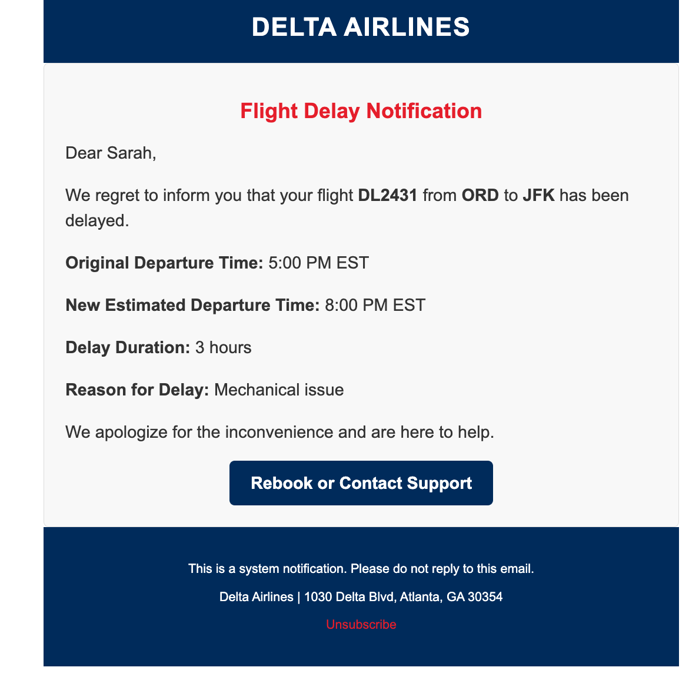

# 📬 AMPscript Email Portfolio — Abdulhakim Sheik

🌟 Faith-driven | Frontline Email Developer | SFMC & AI Automation Learner

This portfolio showcases my real-world AMPscript projects across industries like airlines, healthcare, and online Islamic education (Sufi Academy). All built with HTML, CSS, AMPscript, and mockups — no guesswork.

---

## 🔥 Most Recent Project

### 🏥 Test Result Notification Email  
📄 [`test-result-notification.html`](emails/healthcare/test-result-notification.html)  
📸 **Customer View:**  

---

## 🕌 Sufi Academy Projects

### 📘 Qur’an Course Welcome Email  
📄 [`welcome-email.html`](emails/sufiacademy/welcome-email.html)  
📸 Preview:  

### 📝 Thank You Email  
📄 [`thank-you-email.html`](emails/sufiacademy/thank-you-email.html)  
📸 Preview:  

---

## ✈️ Airline Email Projects

### 🎫 Loyalty Miles Reward Email  
📄 [`loyalty-miles-reward.html`](emails/airline/loyalty-miles-reward.html)  
📸 Preview:  

### 🛫 Flight Cancellation Alert  
📄 [`flight-cancellation.html`](emails/airline/flight-cancellation.html)  
📸 Preview:  

### ⏰ Delay Notification  
📄 [`flight-delay.html`](emails/airline/flight-delay.html)  
📸 Preview:  

### 🎟 Boarding Pass  
📄 [`boarding-pass.html`](emails/airline/boarding-pass.html)  
📸 Preview:  

---

## 🛠️ Tech Stack

- Salesforce Marketing Cloud (AMPscript)
- HTML, CSS (inline for email clients)
- Git, GitHub, VS Code
- AI-assisted automation + prompt engineering
- Real-world use cases with mockups

---

## 🧭 Goal

🎯 Master SFMC, SQL, and automation — land freelance work with airlines and healthcare teams, and eventually build my own agency, in sha’ Allah.

    